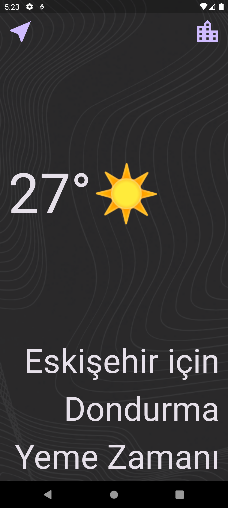

## Özet
  Openweather api kullanarak yazdığım retro hava durumu uygulaması. 

<h3>Uygulama - Ekran Görüntüleri</h3>

  <table style="width: 100%;">
    <tr>
      <td colspan="4" style="text-align: center;"><h2>Giriş / Kayıt Ol</h2></td>
    </tr>
    <tr>
      <td style="width: 25%;"></td>
      <td style="width: 25%;"></td>
      <td style="width: 25%;"></td>
    </tr>
